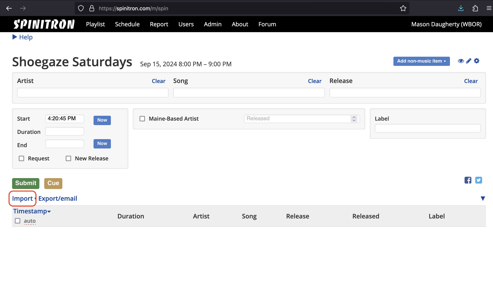

# Importing Spotify Playlists Into Spinitron

## Exportify

- Navigate to [Exportify](https://rawgit.com/watsonbox/exportify/master/exportify.html)
- Click "Get Started"
- Log in to your Spotify account and grant Exportify access to your playlists
- From the list, find the playlist you want exported and click the green "Export" button. This will download a .csv file to your machine. Make note of where this file is saved.

Now that we have the .csv downloaded, it's time to import it into Spinitron.

## Spinitron

- Log in to Spinitron make a new playlist
- With the song-entry form open, select the "Import" button that is below the green "Submit" button:

- Under "File", browse to and select the .csv you saved in the previous section
- Press the green "Process" button
- From "Artist fields":
  - Drag the "Artist" button pill to the "Artist Name(s)" column
- From "Song fields":
  - Drag the "Song" button pill to the "Track Name" column
- From "Release fields":
  - Drag the "Release" button pill to the "Album Name" column
- "Released" and "Duration" may attempt to auto-match with "Album Release Date" and "Track Duration (ms)" - these will fail due to unit mismatches, so you should un-set them by dragging the button pills back to the top of the screen.
- Press the green "Import" button

## After

- Now just add in all of the relevant missing information.
  - One drawback is that Spotify does not provide label names. From what I can tell, there is no work around to this. So we'll have to submit them ourselves.
  - Same goes for track duration and release year.
- Done!
